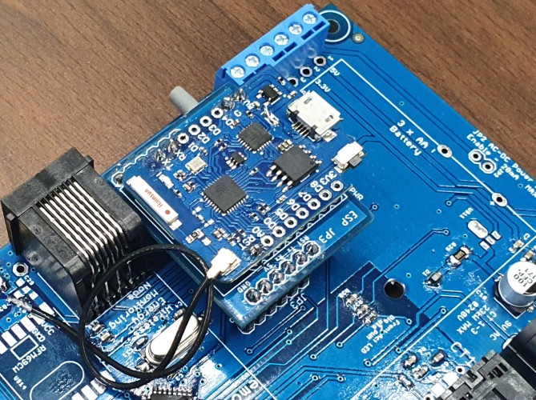
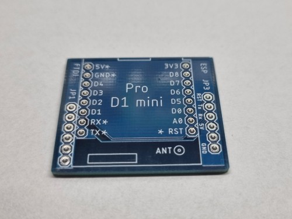
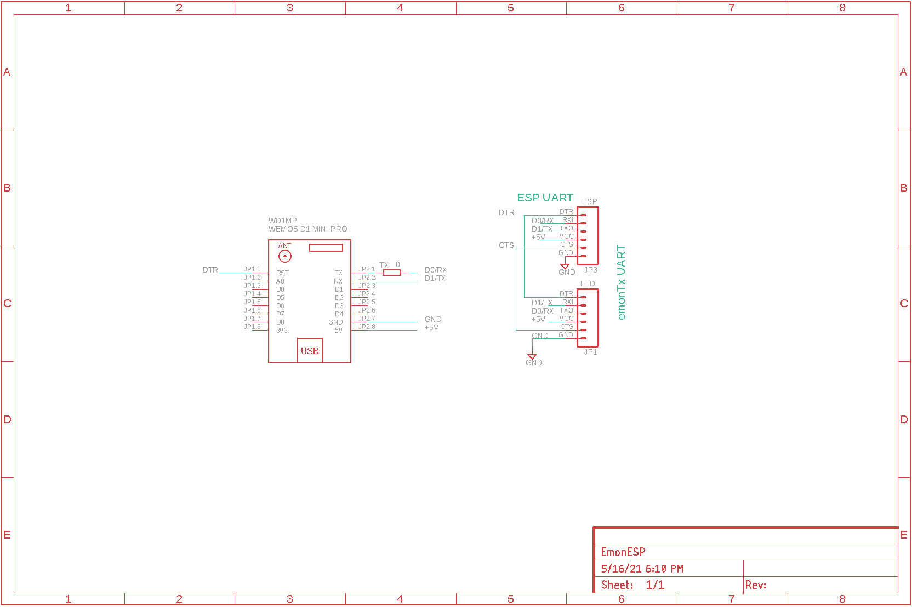
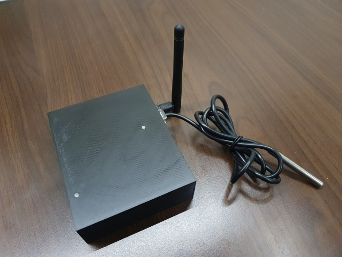
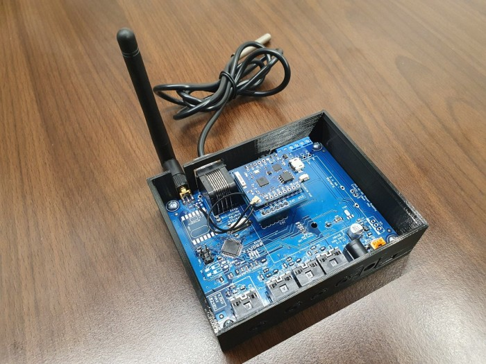

# EmonESP-module
EmonESP WiFi module based on Wemos D1 mini (PRO)

Thanks to this PCB, you can easily attach Wemos D1 mini board to EmonTX v3.

## PCB v01 (05-2021)

## Schematic

## 3D printed case for EmonTX v3 with EmonESP
https://www.thingiverse.com/thing:5149944

